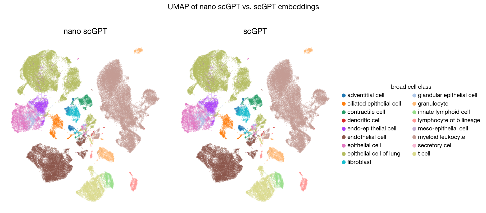

# nano-scGPT

The simplest, fastest repository for scGPT inference, (soon) finetuning and training, with minimal dependencies. It reimplements the original [scGPT](https://github.com/bowang-lab/scGPT) from scratch. `nano_scgpt/model.py` is pure PyTorch in ~270 lines of code, and `nano_scgpt/scGPT_tokenizer.py` turns raw scRNA data into model input. Small enough to read in one sitting and hack on.



*Embeddings are numerically equivalent to the original scGPT.*

## Why nano-scGPT
Cell modeling is potentially the most exciting and under-indexed AI/ML area. The hope is to make state-of-the-art cell models more accessible to run, understand, and tinker with.

## Runtime
nano-scGPT produces embeddings numerically equivalent to the original
while running **1.38x** faster, mostly from a clean forward pass plus `torch.compile`.

<!-- | Stage (per batch) | nano-scGPT | scGPT    |
| ----------------- | ---------- | -------- |
| Data loading      | 0.0282 s   | 0.0309 s |
| Forward           | 0.2690 s   | 0.3809 s | -->

| Model      | Total (65,847 cells) | Per cell | Throughput  | Speedup |
| ---------- | -------------------- | -------- | ----------- | ------- |
| nano-scGPT | 77.7 s               | 1.18 ms  | **847 cells/s** | **1.38×**   |
| scGPT      | 107.0 s              | 1.63 ms  | 615 cells/s | 1.00×   |

<!-- The gain is almost entirely in the forward pass.The original scGPT carries a lot of unnecessary branches and checks; nano-scGPT's clean implementation is also what lets `torch.compile` actually help. -->

> benchmarked under: A100, batch size 256, AMP autocast, Tabula Sapiens lung (65,847 cells).

## Install
```bash
git clone https://github.com/Danqi7/nano-scGPT.git
cd nano-scGPT
pip install -e .       # or: uv pip install -e .
```

## Quick Start
```python
# scGPT Embedding example
import numpy as np
from nano_scgpt.scGPT_tokenizer import scGPTTokenizer
from nano_scgpt.model import scGPTModel

model = scGPTModel.from_pretrained("scGPT_human") # weights pulled from HF hub
model.eval()

tokenizer = scGPTTokenizer.from_pretrained("scGPT_human")
genes = ['DUX4L30', 'CTB-52I2.4', 'USP17L16P', 'RPL7P23']
exprs = np.array([[1.0, 0.0, 23.0, 6.0], [0.0, 0.0, 3.0, 7.0]])
encoded = tokenizer.encode(exprs, genes)
embeddings = model.encode(encoded["gene_ids"], encoded["exprs"], encoded["padding_mask"]) # [N, D_embd]

```

## Task: Embed .h5ad scRNA data
```sh
# Example: Tabula Sapiens lung data (downloaded automatically)
python tasks/embedding.py

# Or on your own local file
python tasks/embedding.py \
    --input <path to local .h5ad file> \
    --output <path to save embeddings>

# Or from a remote URL
python tasks/embedding.py \
    --input_url <URL to a remote .h5ad file> \
    --output <path to save embeddings>
```

## todos
- [ ] Finetuning for perturbation response prediction
- [ ] Training from scratch

Let me know what tasks or even models you'd like to see next!

## Acknowledgments
1. This repository reimplements scGPT from scratch. All credit for the original model and method goes to the authors (Cui et al., *Nature Methods*, 2024). See the [original repo](https://github.com/bowang-lab/scGPT) and [paper](https://doi.org/10.1038/s41592-024-02201-0).
2. nano-scGPT is inspired by Andrej Karpathy's [nanoGPT](https://github.com/karpathy/nanogpt) and Chris Hayduk's [minAlphaFold2](https://github.com/ChrisHayduk/minAlphaFold2).
